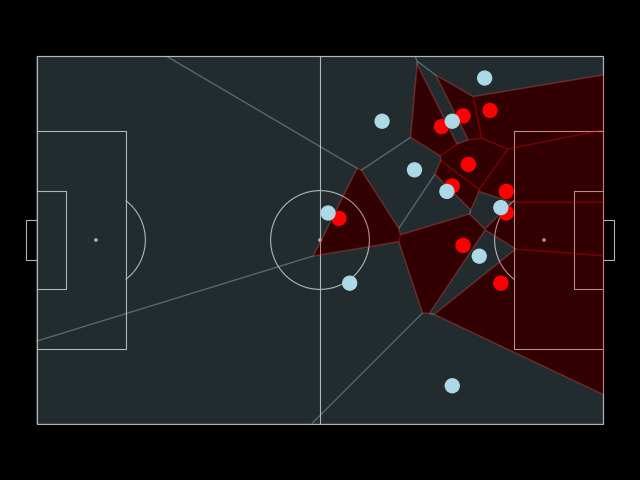
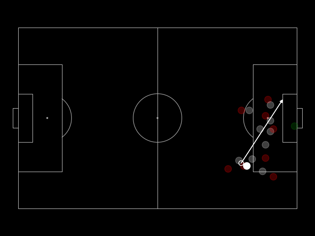
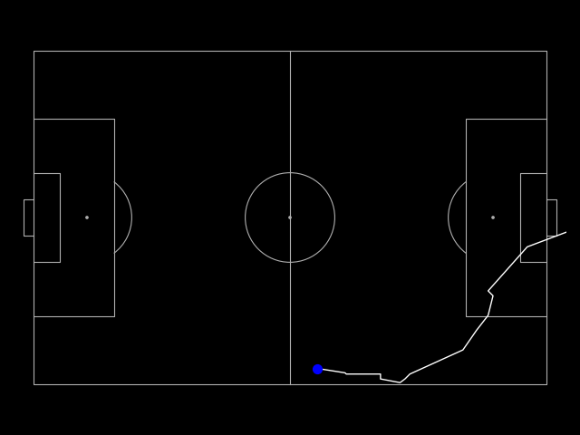
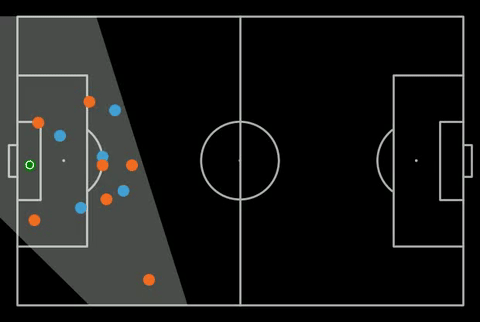

# Eagle

<div align="center">
  <p>
  
  </p>
  <div>
<a target="_blank" href="https://colab.research.google.com/drive/1oGiZA0uj9MIarkhg2ty21WC4A0KXuhZX?authuser=3#scrollTo=h1KXqSjicSJU">
  
</a>
  </div>
  <br>
</div>

## Introduction 
Eagle converts football broadcast data from television feeds to tracking data useful for analysis and visualisation. It uses a collection of custom trained models and a variety of computer vision techniques to identify, track and obtain player and ball coordinates from each frame of broadcast data.

Unlike other solutions, Eagle is designed to work **directly on broadcast data** and does not require special scouting feeds or angles. It can read and process clips directly from matches. The GIF above is an example of how Eagle can generalize to all sorts of camera angles. 

For more information, refer to the [documentation](docs/algorithm.md).

## Example Use Cases 
Eagle can be used to create a variety of visualisations and metrics. Here are some (non exhaustive) examples beyond creating the Minimap from the GIF above (example script: <a href="https://github.com/nreHieW/Eagle/blob/main/examples/minimap.py" target="_blank">`minimap.py`</a>).
### Voronoi Diagram 
Eagle can be used to create Voronoi diagrams of the pitch. This is useful for visualising the movement of players and the areas they occupy on the pitch. An example script is provided in the `examples` folder under <a href="https://github.com/nreHieW/Eagle/blob/main/examples/voronoi.py" target="_blank">`voronoi.py`</a>. The example here is from Manchester City's goal against Nottingham Forest.

<table align="center">
  <tr>
    <td align="center" valign="middle"></td>
    <td align="center" valign="middle"></td>
  </tr>
</table>

### Pass Plot
Eagle can be used to create pass trajectories. This can be used to create metrics related to the nature of any single pass. An example script is provided in the `examples` folder under <a href="https://github.com/nreHieW/Eagle/blob/main/examples/pass.py" target="_blank">`pass.py`</a>. The example here is Lamine Yamal's assist during the Euros.

<table align="center">
  <tr>
    <td align="center" valign="middle"></td>
    <td align="center" valign="middle"></td>
  </tr>
</table>

### Player Trajectory
Eagle can be used to visualize the movement of a player over time. This can be useful for metrics such as distance covered, speed, etc and can also be used to see how players position. An example script is provided in the `examples` folder under <a href="https://github.com/nreHieW/Eagle/blob/main/examples/trajectory.py" target="_blank">`trajectory.py`</a>. The example here is Lionel Messi's goal against Athletic Bilbao.

<table align="center">
  <tr>
    <td align="center" valign="middle"></td>
    <td align="center" valign="middle"></td>
  </tr>
</table>

## Usage 
### Colab Usage (Recommended)
<a target="_blank" href="https://colab.research.google.com/drive/1oGiZA0uj9MIarkhg2ty21WC4A0KXuhZX?authuser=3#scrollTo=h1KXqSjicSJU">
  
</a>

It is recommended to use Eagle in the provided Google Colab notebook especially if you are not familiar with Python or you don't have a GPU. A GPU is highly recommended for faster inference. It is a self-contained environment that allows you to run Eagle without having to install any dependencies. You can also use the provided <a href="https://colab.research.google.com/drive/1oGiZA0uj9MIarkhg2ty21WC4A0KXuhZX?authuser=3#scrollTo=h1KXqSjicSJU" target="_blank">notebook</a> to run Eagle on your own data.

You will need to upload your video and follow the instructions in the notebook. 

### Local Usage
If you want to run Eagle locally, first install [uv](https://docs.astral.sh/uv/getting-started/installation/)
```bash
curl -LsSf https://astral.sh/uv/install.sh | sh
```

Then, clone the repository
```bash
git clone https://github.com/nreHieW/Eagle.git
cd Eagle
```

Finally, you will need to download the weights of the models. 
```bash
cd eagle/models
sh get_weights.sh
cd ../../
```
An inference script is provided. First, obtain a clip of the broadcast data that you want to use as an `.mp4` file. Eagle works best in clips where the camera position is relatively stable (ie no changes in angle). You can use [FFmpeg](https://ffmpeg.org/) to trim as necessary using the following example.

```bash
ffmpeg -ss 00:00:07 -to 00:00:15 -i video.mp4 -c copy input_video.mp4
```
Then run the following. You can also change the FPS depending on the granularity required using the `--fps` argument.
```bash
uv run main.py --video_path input_video.mp4 # Replace with your video name
```
The output data can be found in `output/(input_video)/`. For a detailed description of the output data format refer to [the documentation](docs/data.md).

## Advanced Usage 
Eagle works best in CUDA enabled GPU environments or at the very least with [Apple Metal](https://developer.apple.com/metal/pytorch/). If you do not have access to such resources, feel free to use the <a href="https://colab.research.google.com/drive/1oGiZA0uj9MIarkhg2ty21WC4A0KXuhZX?authuser=3#scrollTo=h1KXqSjicSJU" target="_blank">Google Colab provided</a>. There are different variants of models provided - both [PyTorch](https://pytorch.org/) and [ONNX](https://onnx.ai/) formats as well as different sizes of the detector model. Feel free to choose the relevant format/sizes for your hardware requirements. Feel free to change the Tracker model used as well.

The Homography Calculation and Keypoint detection are pretty computationally expensive operations. If you have the compute requirements, feel free to invoke them more often as it might lead to more accurate results. They are controlled by the `num_homography` and `num_keypoint_detection` parameter which determine the number of times each of the operations are carried out per second respectively. 

##### Parameters
- `keypoint_conf` (default 0.3): HRNet keypoint minimum score.
- `detector_conf` (default 0.35): YOLO minimum confidence; a lower internal floor (0.15) is used to feed the tracker robustly.
- `num_homography`: homography recomputations per second (>=1 recommended).
- `num_keypoint_detection`: HRNet inferences per second (increase for accuracy; decrease for speed).
- `calibration`: enable brightness-based micro-adjustment of keypoint pixels.


### Model Weights 
There are 5 different model weights that can be downloaded with the provided `eagle/models/get_weights.sh` script. For the YOLO detectors, both standard PyTorch and ONNX formats are provided. By default, the PyTorch formats are used. If you are using Eagle in CPU-only environments, refer to this [guide](https://docs.ultralytics.com/integrations/onnx/#usage) on how to use the ONNX formats together with YOLO. If CPU is detected, Eagle will default to the Medium Detector Model. 
- `keypoints_main.pth`: The HRNet Backbone Keypoint detector model. 
- `detector_medium`: The medium sized YOLOv8 model. It is trained on image size 640 and has faster inference speed.
- `detector_large`: The large sized YOLOv8 model. It is trained exactly the same as `detector_medium` but with a higher parameter count.
- `detector_large_hd`: A large sized YOLOv8 model trained on image size 960. The increased resolution results in improved performance and especially for the ball detection, its recall is much higher. However, it has a much slower inference speed. This is the default.

Depending on the hardware you have available and your use-case, different model sizes might suit your needs differently. 

Eagle also defaults to [BoTSORT](https://arxiv.org/pdf/2206.14651.pdf) for tracking. Refer to [this repo](https://github.com/mikel-brostrom/yolo_tracking) for more details.

### Limitations
Given that Eagle was trained on consumer hardware, it is not 100% accurate especially when dealing with irregular camera angles or heavy occlusion of players and frames. While wider camera angles such as those used in scouting feeds are preferred, Eagle is trained on standard broadcast data so it would work just fine. While many attempts and heuristics are in place to handle the inaccuracies, it is still highly recommended to use `annotated.mp4` to determine if there are any errors in the output before using the data provided. 

Some common debugging strategies:
- The most common issue is incorrect team assignment. Team assignment is currently done purely based on heuristics. The solution is to simply manually edit the team mapping dictionary in the metadata.
- Eagle is generally able to track player positions well but the second most common issue is when balls are not detected (given their size). This could cause erratic ball coordinates since Eagle interpolates the coordinates. One solution is to reduce the confidence threshold required for the detector (`detector_conf`).
- A homography requires 4 points at minimum. Some camera angles makes this difficult. One solution is to reduce the confidence threshold for the keypoint detector (`keypoint_conf`).
- Lastly, if the ball detections are extremely inaccurate, one solution is to increase the input resolution to get higher recall. If the model is detecting many objects as ball, set `filter_ball_detections=True` for the processor which will attempt to use a Kalman Filter to smooth out and detect outliers.
- It is also recommended to ensure that your clip is trimmed to the relevant part of the game.

An example of the above is shown below. The ball and player coordinates are generally accurate but the ball detections aren't 100% accurate.
<table align="center">
  <tr>
    <td align="center" valign="middle"></td>
    <td align="center" valign="middle"></td>
  </tr>
</table>

## Output Explanation 
Outputs are stored in `output/(your video name)/`. All transformed coordinates use the UEFA pitch specifications (105 x 68). For detailed breakdown of the coordinate system and data output, see [this file](docs/data.md).

## Future Improvements
With more compute resources and more data, it would be possible to train better models at even higher resolution. Additional features are also in the works such as ReID and better team assignment which can make Eagle stronger and more robust as well as making the entire pipeline faster. Any contribution to Eagle is deeply appreciated! 

If you found Eagle to be useful, please consider citing it in your work. Also, please do reach out to me if you have any suggestions or feedback!

## Acknowledgements
Huge acknowledgements goes to the following projects that have helped the development of Eagle tremendously:
- Code in a Jiffy's [code](https://github.com/abdullahtarek/football_analysis) and [YouTube](https://www.youtube.com/watch?v=neBZ6huolkg&)
- Roboflow's [sports repo](https://github.com/roboflow/sports)
- Training code for keypoint detection in PyTorch by [tlpss](https://github.com/tlpss/keypoint-detection)
- The [Soccernet](https://github.com/SoccerNet) team for the data they have provided
- The [winning team](https://github.com/NikolasEnt/soccernet-calibration-sportlight) from the Soccernet Camera Calibration Challenge 2023
- An easy way to use Trackers by [mikel-brostrom](https://github.com/mikel-brostrom/yolo_tracking)
