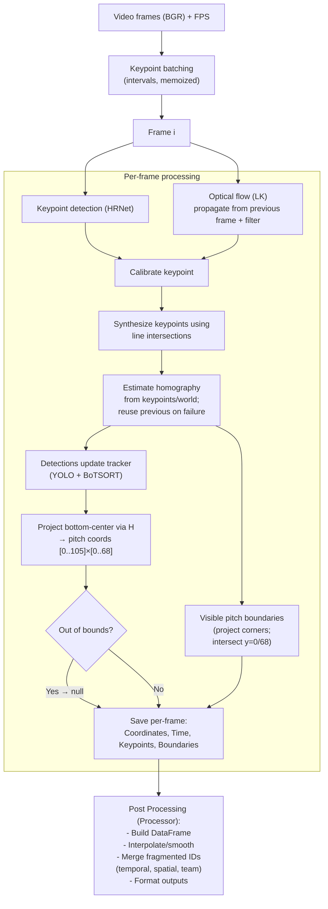

## Eagle Algorithm

This document explains, end-to-end, how Eagle converts broadcast video frames into on‑pitch coordinates (UEFA 105×68).

#### Inputs and outputs
- Inputs:
  - Frames: BGR images from OpenCV
  - FPS: frames per second used for sampling and timing
- Outputs per frame (see docs/data.md for schemas):
  - `Coordinates`: detections (Players/Goalkeepers/Ball) with boxes, confidences, bottom-center in image space, and pitch coordinates
  - `Time`: clock in MM:SS
  - `Keypoints`: field landmarks in image space
  - `Boundaries`: visible pitch quadrilateral in pitch coordinates [Bottom_Left, Top_Left, Top_Right, Bottom_Right]

#### Core components
The pipeline is made of 2 main models. Both models are run at a fixed interval.
- Object detector + tracker
  - YOLO detector (size varies by device) finds Players, Goalkeepers, Ball, etc.
  - BoTSORT tracker assigns stable IDs frame-to-frame.
  - We keep Players/Goalkeepers for projection
  - For each detection, we use the bounding box bottom-center as the contact point with the ground. This is the coordinate that is used for projection.

- Pitch keypoint model
  - HRNet-based `KeypointModel` predicts 57 heatmaps for fixed field landmarks; see `eagle/utils/pitch.py` and `docs/data.md` for labels and world coordinates.
  - Keypoints are thresholded by confidence and deduplicated by highest score.
  - To calibrate keypoints, if a keypoint pixel is dim, search a small neighborhood in HSV for the brightest spot. (The assumption is that the keypoints should lie on the white pitch markings.)

#### Full Pipeline
1) Pre-batch keypoints
   - Sample frames at `num_keypoint_detection` per second; run HRNet in batches; memoize predictions per sampled frame.

2) For each frame i
   - Convert to grayscale for optical flow.
   - Keypoints at intervals:
     - On first frame or at keypoint interval, use memoized HRNet prediction (or run on-demand).
     - If <4 keypoints (we need at least 4 keypoints to estimate a homography):
       - If i==0: scan forward to find a frame with ≥4 keypoints, then propagate backward via optical flow to seed the first frames.
       - Else: propagate current keypoints from previous frame via optical flow and merge with model detections.
   - Keypoints between intervals:
     - Propagate previous keypoints with optical flow; if <4 after filtering, run model and merge.
   - Optional: Calibrate Keypoints
     - If a keypoint pixel is dim, search a small neighborhood in HSV for the brightest spot. 
   - Synthesize Geometry-based keypoints. 
    - Keypoints that lie on the same X or Y axis are fitted with a line and the intersection of the lines is used to synthesize the keypoint. This allows keypoints that are not detected or outside the frame to be used for the homography as well. This helps to improve the overall recall of the keypoints.

3) Object detections and IDs
   - Detections are used to update the tracker.

4) Homography update
   - Use the keypoints and their world coordinates to estimate a homography.
   - Keep inliers if mask is returned; store as current homography. If estimation fails, reuse previous and try again next frame.

5) Project detections
   - For each Player/Goalkeeper, project bottom-center through the current homography to pitch coordinates.
   - If projection falls outside [0,105]×[0,68], mark `Transformed_Coordinates = null`. This is to indicate that the object is out of bounds.

6) Visible pitch boundaries
   - Project image corners through the homography; intersect edges with y=0 and y=68 to form the visible quadrilateral [BL, TL, TR, BR].

7) Post Processing
    - There might be times where the tracker has ID fragmentation - the same player is given different IDs at different times. This is because the tracker is not able to track the player across frames. To fix this, we use a simple merging logic to merge the IDs that represent the same player.
    - The merging logic relies on 3 conditions:
      1) Temporal proximity: The two IDs must have been seen within a certain time threshold.
      2) Spatial continuity: The two IDs must have been seen within a certain distance threshold.
      3) Team consistency: The two IDs must have the same team.

#### Pipeline diagram

#### References in code
- `eagle/models/coordinate_model.py` (full pipeline implementation)
- `eagle/models/keypoint_hrnet.py` (HRNet keypoint backbone and head)
- `eagle/utils/pitch.py` (landmark labels, UEFA dimensions, ground-truth coordinates)