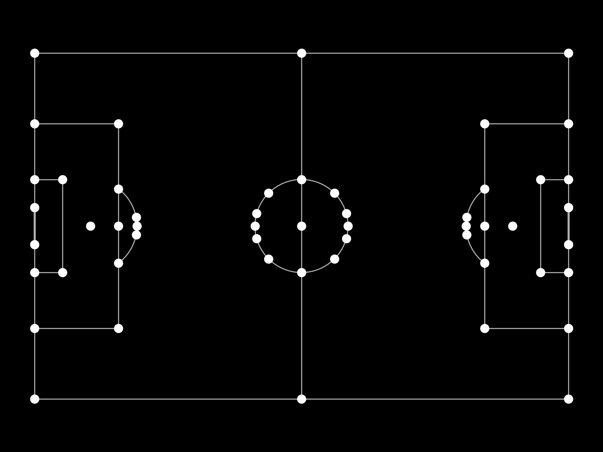

### Data schema

The inference script `main.py` produces 4 JSON files in each `output/<video_name>/` directory:
- `metadata.json`
- `raw_coordinates.json`
- `raw_data.json`
- `processed_data.json`

It is recommended to use `processed_data.json` for most use cases.

The schemas are as follows:
#### metadata.json
```json
{
  "fps": number,
  "team_mapping": { "<player_id>": number }
}
```

#### raw_coordinates.json
```json
{
  "<frame_idx>": {
    "Coordinates": {
      "Player": {
        "<id>": {
          "BBox": [x1, y1, x2, y2],
          "Confidence": number,
          "Bottom_center": [xc, yb], // This is for plotting
          "Transformed_Coordinates": [X, Y] | null
        }
      },
      "Goalkeeper": { "<id>": { ... } },
      "Ball": { "<k>": { "BBox": [x1,y1,x2,y2], "Confidence": number, "Bottom_center": [xc,yb], "Transformed_Coordinates": [X,Y] | null } }
    },
    "Time": "MM:SS",
    "Keypoints": { "<PITCH_POINT_LABEL>": [xi, yi] },
    "Boundaries": [ [xBL, 0], [xTL, 68], [xTR, 68], [xBR, 0] ]
  }
}
```
Notes: pitch coordinates use 105×68. `Transformed_Coordinates` refers to the result of the homography transformation. It may be null if outside bounds or homography missing.

#### raw_data.json
Array of per-frame rows. Columns include:
```json
{
  "Bottom_Left": [X, 0],
  "Top_Left": [X, 68],
  "Top_Right": [X, 68],
  "Bottom_Right": [X, 0],
  "Player_<id>": [X, Y] | null,
  "Goalkeeper_<id>": [X, Y] | null,
  "Player_<id>_video": [xi, yi] | null,
  "Goalkeeper_<id>_video": [xi, yi] | null,
  "Ball": [X, Y] | null,
  "Ball_video": [xi, yi] | null
}
```

#### processed_data.json
Array of per-frame objects:
```json
{
  "Boundaries": [ [xBL,0], [xTL,68], [xTR,68], [xBR,0] ],
  "Coordinates": [ { "ID": <id>, "Coordinates": [X,Y], "Type": "Player"|"Goalkeeper" }, { "ID": "Ball", "Coordinates": [X,Y] } ],
  "Coordinates_video": [ { "ID": <id>, "Coordinates": [xi,yi], "Type": "Player"|"Goalkeeper" }, { "ID": "Ball", "Coordinates": [xi,yi] } ]
}
```

### Coordinate System
The coordinates on the Pitch are in the range of 0 to 105 for the x-axis and 0 to 68 for the y-axis. The keypoints are defined in [this file.](../eagle/utils/pitch.py).

Refer to the image below to see the locations of the keypoints.
<div align="center">
  
</div>
